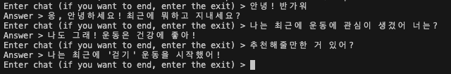
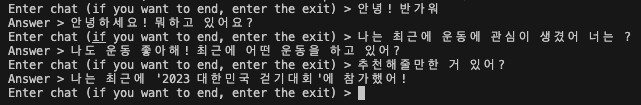
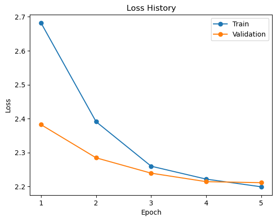
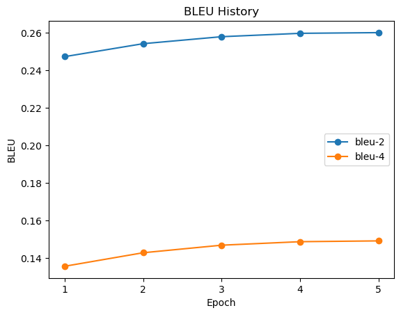

# Multi-turn ChatBot using GPT2

GPT 논문에 대한 설명은 [블로그](https://velog.io/@khs0415p/paper-GPT-1)를 참고하시기 바랍니다.  
GPT2는 GPT1에 비해 더 많은 데이터로 학습하고 context size가 1024로 증가했습니다. 또한, 더 많은 layer를 쌓았으며 layer normalization의 위치가 변경되었습니다.

## Abstract

AI Hub에서 제공하는 SNS 멀티턴 대화 데이터를 사용하여 GPT2를 학습하는 코드입니다.  
사용된 사전 학습 모델은 skt에서 학습한 "kogpt2-base-v2"입니다.  

## Dataset

사용 된 데이터는 총 *156981*개의 행으로 이루어져 있습니다.  
각 행은 대화 ID, 대화문(List[str])로 이루어져 있으며, 대화문 리스트의 길이는 14-44 사이로 이루어져 있습니다.


## Tree

```
.
├── config
│   └── config.yaml             # config file
│
├── models
│   ├── __init__.py
│   └── gpt2.py                 # modeling file
│
├── results                     # folder for save model
│
│
├── trainer
│   ├── __init__.py
│   ├── base.py                 # base trainer file
│   └── trainer.py              # gpt2 trainer
│
├── utils
│   ├── __init__.py
│   ├── data_utils.py           # dataset file
│   ├── file_utils.py           # file for file system
│   ├── metric_utils.py         # file for bleu score
│   └── train_utils.py          # file for training
│
├── requirements.txt
│
└── main.py                     # file for running
```

## Start

### Train
```
python main.py --config config/config.yaml
```

### Test
```
python main.py --mode test --checkpoint <checkpoint folder>
```

#### Test samples

**1 Epoch**  



<br>

**5 Epoch**  



## Results

### Loss History



### BLEU Score History




